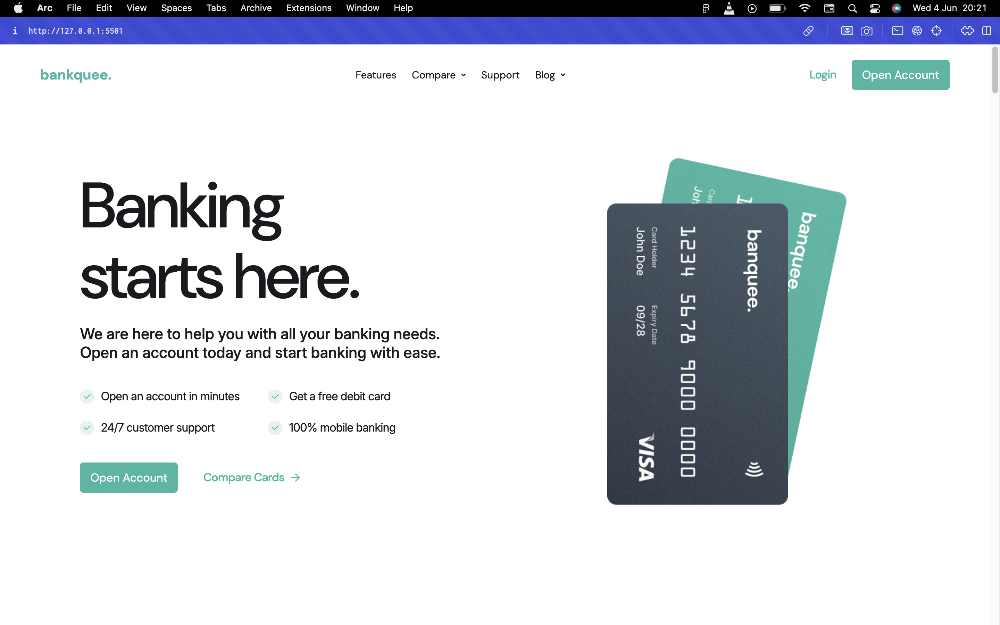
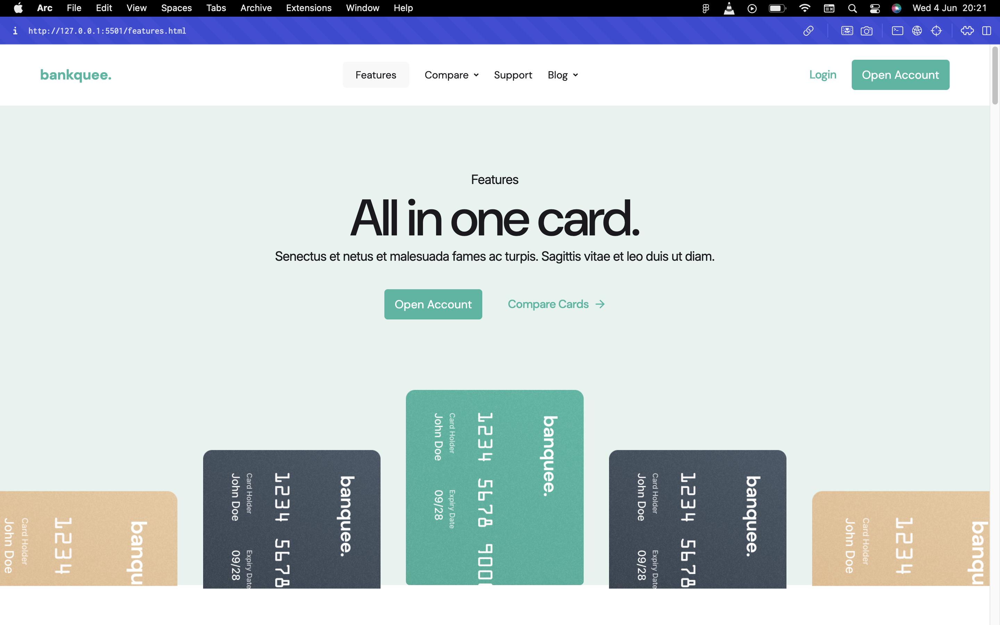
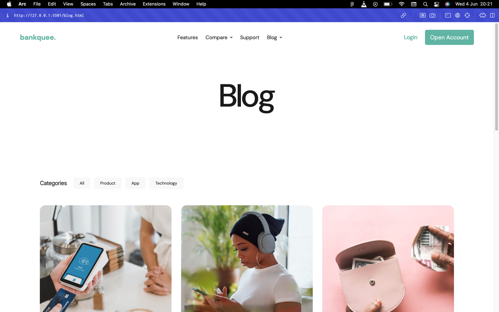
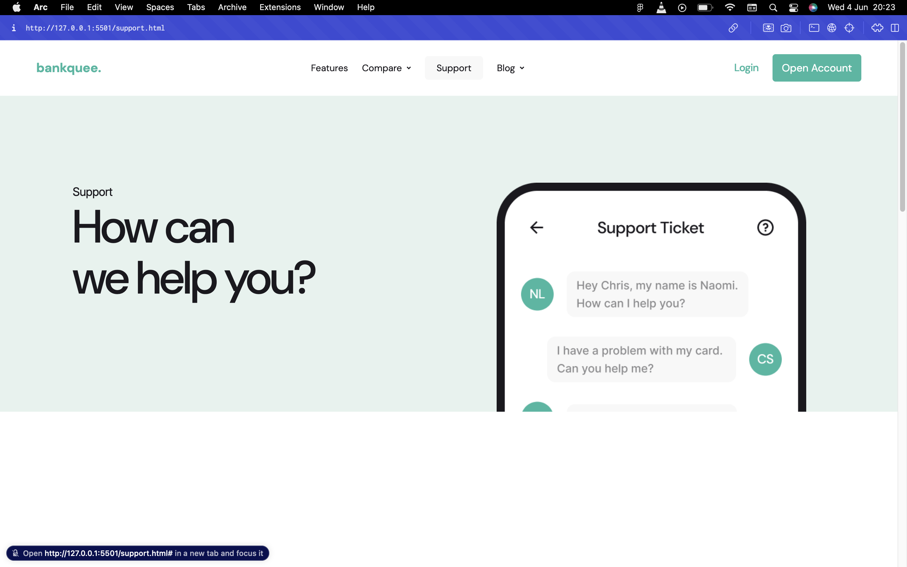

# 💼 Banquee – SaaS Banking Website

A modern, responsive multi-page website for **Banquee**, a fictional SaaS banking platform. This project showcases clean UI/UX design, semantic HTML structure, and responsive layouts, serving as a demonstration of front-end development skills.

🔗 Live Demo: [banquee-eta.vercel.app](https://banquee-eta.vercel.app)

---

## 📸 Screenshots

_Home Page_

_Features Page_

_Blog Page_

_Support Page_

---

## 📚 Table of Contents

- [Overview](#overview)
- [Built With](#built-with)
- [Features](#features)
- [What I Learned](#what-i-learned)
- [Author](#author)
- [License](#license)
- [Contact](#contact)

---

## 📝 Overview

**Banquee** is a fictional SaaS banking platform website designed to demonstrate proficiency in front-end development. The site includes multiple pages—Home, Features, Blog, and Support—each crafted with attention to responsive design and user experience.

---

## 🛠️ Built With

- HTML5
- CSS3
- Sass (SCSS)
- Tailwind CSS
- JavaScript

---

## ✨ Features

- **Responsive Layout**: Optimized for desktops, tablets, and mobile devices.
- **Multi-Page Structure**: Separate pages for Home, Features, Blog, and Support.
- **Clean Design**: Minimalist aesthetic focusing on content and usability.
- **Semantic HTML**: Ensures accessibility and SEO friendliness.

---

## 🌱 What I Learned

- Structuring multi-page websites with consistent navigation.
- Implementing responsive designs using Flexbox, Grid, and media queries.
- Enhancing user experience with clean and intuitive layouts.
- Utilizing Sass for modular and maintainable CSS.
- Integrating Tailwind CSS for utility-first styling.

---

## 👤 Author

**Prosper Alex**  
Front-End Developer & Designer  
[LinkedIn](https://www.linkedin.com/in/prosper-alex) | [Twitter](https://twitter.com/prosper_alex)

---

## 📄 License

This project is licensed under the MIT License.

---

## 📬 Contact

For inquiries or feedback, feel free to reach out via email: [prosperalex0110@gmail.com](mailto:prosperalex0110@gmail.com)
